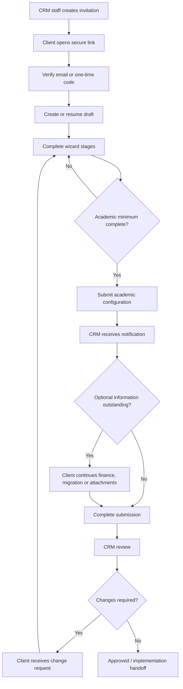

# Client Setup Wizard — Phased Implementation Plan

## Document control

| Item | Value |
|---|---|
| Feature | Public, resumable client setup wizard for college implementation discovery |
| Product area | Heritage Pro CRM |
| Primary audience | College implementation contacts and Heritage Pro CRM implementation staff |
| Status | In progress — production rollout preparation |
| Owner | Heritage Pro product and implementation team |
| Source questionnaire | `/Users/thatoobuseng/Downloads/College_System_Initial_Setup_Questionnaire.docx` |
| Source templates | `/Users/thatoobuseng/Downloads/import-staff-colleges.xlsx`, `/Users/thatoobuseng/Downloads/import-students-colleges.xlsx` |
| Last updated | 2026-08-11 |

## 1. Purpose

Replace the Word-based college setup questionnaire with a public, CRM-themed, multi-stage wizard that clients can complete over several sessions.

The wizard must allow a client to:

- Open a secure link without having a CRM account.
- Complete information in small, understandable stages.
- Save progress automatically and resume later from another device.
- Complete the required academic information first.
- Submit the academic configuration even when finance and other optional information is incomplete.
- Return later to add optional information or respond to requested changes.
- Download staff and student import templates.
- Optionally upload completed data files and supporting documents.

Heritage Pro staff must be able to access, review, assign, comment on and track every client submission from the CRM.

## 2. Current repository context

The existing CRM already provides useful conventions that should be reused:

- CRM visual language: `resources/views/layouts/crm.blade.php` and `resources/views/layouts/crm-theme-styles.blade.php`.
- CRM form vocabulary: `crm-card`, `crm-field`, `crm-field-grid`, `crm-form`, `crm-tabs`, `crm-pill`, `crm-action-row` and `btn-loading`.
- Existing authenticated staff onboarding: `app/Http/Controllers/Crm/OnboardingController.php` and `routes/crm/onboarding.php`.
- Existing import workspace: `app/Http/Controllers/Crm/ImportController.php`, `app/Services/Crm/Imports/` and `resources/views/crm/settings/imports.blade.php`.
- Config-driven CRM permissions: `config/heritage_crm.php` and `EnsureCrmAccess`.
- Private document storage: the `documents` filesystem disk.

The existing staff onboarding must not be repurposed. It is an authenticated employee profile flow. The new wizard is a separate public client setup workflow with its own models, routes, access tokens and review process.

The current repository does not contain the college project's online application form. The new wizard should reproduce the desired interaction pattern—stage navigation, progressive completion, repeatable sections and review-before-submit—while using the CRM theme and existing Laravel conventions.

## 3. Guiding decisions

### 3.1 Public, but invitation-specific

The form is public in the sense that the client does not need a CRM login. It must not be a single unrestricted form URL shared by every client.

Each client receives a unique invitation URL containing a high-entropy token. The token is stored hashed and can be expired, revoked and regenerated by CRM staff.

Recommended URL shape:

```text
https://heritagepro.co.bw/setup/{invitation-token}
```

The URL must not contain the institution name, email address or other personal information.

### 3.2 Academic submission is independent from overall completion

The system must track two separate states:

1. Academic configuration readiness/submission.
2. Overall setup completion.

This allows a client to submit the academic setup while finance, integrations or optional migration information remains outstanding.

### 3.3 Staging before production

Client answers and uploads are implementation discovery data. They must not automatically create or modify production academic records.

The CRM implementation team reviews and approves the information before translating it into implementation configuration or controlled imports.

### 3.4 Server-rendered first

Use server-rendered Laravel Blade stages with small progressive-enhancement JavaScript behaviors for autosave, repeatable rows and upload feedback. Avoid making the entire form dependent on a single large client-side application.

This keeps validation, authorization, recovery and browser compatibility predictable in the existing Laravel application.

### 3.5 Configuration-driven stages

Stage definitions, labels, ordering, required rules and conditional rules should be defined in a dedicated configuration/service registry. They should not be scattered across controllers and Blade templates.

## 4. Target user journey



## 5. Wizard stages

### Stage 0 — Welcome, scope and access

Purpose: establish the institution and create a usable draft.

Core fields:

- Institution legal name.
- Trading/common name.
- Primary contact name, position, email and telephone.
- Intended implementation scope.
- Target go-live period.
- Confirmation that the client is authorized to submit the information.
- Privacy confirmation for attachments and data extracts.

Completion rule: the minimum contact and institution fields must be saved before the client can continue.

### Stage 1 — Institution and academic foundation

Required for academic submission:

- Legal identity, registration and provider details.
- Ownership and institution category.
- Awards offered.
- College mandate and target student population.
- Campuses and delivery sites.
- Brand identity and official contacts.
- Faculties, schools and departments.
- Campus-specific differences.
- Academic year pattern.
- Semesters, periods, intakes and delivery modes.
- Registration, add/drop and markbook closure rules.

Repeatable sections:

- Campuses.
- Responsible contacts.
- Faculties and departments.
- Academic periods.

### Stage 2 — Programme portfolio

Required for academic submission:

- Programme code.
- Programme and qualification name.
- Qualification/award type.
- NQF level.
- Normal duration.
- Mode and campus.
- Active/intake information.
- Entry requirements.
- Completion requirements.
- Programme-specific exceptions.

Repeatable sections:

- Programmes.
- Programme levels.
- Credit rules.
- Admission and completion rules.

### Stage 3 — Curriculum and modules

Required where the college uses curriculum configuration:

- Curriculum version code and name.
- Effective dates.
- Total credits.
- Module code/title.
- Year or level.
- Semester.
- Credits.
- Core/elective status.
- Prerequisites and co-requisites.
- Theory/practical hours.
- Elective pools.
- Practical, clinical, internship or work-placement rules.

The UI must allow the client to add, edit, remove and reorder repeatable module rows without losing previously saved rows.

### Stage 4 — Assessment, grading and GPA

Required for academic submission:

- Assessment categories.
- Assessment sequence.
- Marks and weights.
- Component minimums.
- Compulsory component rules.
- Module pass conditions.
- Default pass mark.
- Examination and continuous-assessment sub-minimums.
- Rounding precision and method.
- Missing-mark treatment.
- SGPA calculation method and formula.
- CGPA calculation method and formula.
- GPA decimal places.
- GPA inclusion/exclusion rules.
- Grade bands and result statuses.

The form must require formulas to be described explicitly enough for the implementation team to reproduce an official result.

### Stage 5 — Progression, retakes and graduation

Required for academic submission:

- Progression evaluation timing.
- Academic standing inputs.
- Progression decision matrix.
- Rule precedence when multiple conditions apply.
- Retake and supplementary assessment rules.
- Maximum attempts.
- Mark caps.
- Repeated-module GPA treatment.
- Appeals and overrides.
- Graduation gates.
- Award approval authority.
- Classification bands.

### Stage 6 — Results, transcripts and student lifecycle

Required or conditional:

- Semester result-slip requirements.
- Complete transcript requirements.
- Publication and withholding rules.
- Correction, replacement and reissue rules.
- Applicant routes.
- Admission statuses.
- Student number format.
- Duplicate detection rules.
- Student lifecycle statuses.
- Semester registration and withdrawal rules.

Required evidence should include blank or fully redacted result-slip and transcript samples where applicable.

### Stage 7 — Migration and data readiness

The client must be able to:

- State which data will be migrated.
- Identify the source system/file.
- Give approximate record counts and years covered.
- Identify the data owner.
- Describe known data-quality issues.
- Download the staff template.
- Download the student template.
- Upload completed staff and student workbooks.
- Upload supporting migration documentation.

This stage must distinguish between:

- No migration.
- Current data only.
- Historical data.
- Programme/module catalogue migration.
- Marks/results migration.
- Staff/user migration.
- Documents and attachments migration.

### Stage 8 — Finance and integrations

Optional or deferable:

- Finance included in initial go-live.
- Basic fees only.
- Finance deferred.
- External accounting integration.
- Base currency.
- Financial year.
- Billing basis.
- Invoice timing.
- Payment gateway.
- Email/SMS service.
- Identity or single sign-on.
- LMS.
- Government/regulator reporting.
- Library.
- Biometric/attendance devices.

Selecting “Defer” must satisfy the stage without requiring finance details.

### Stage 9 — Users, attachments and sign-off

Required or conditional:

- User roles and approximate user counts.
- Permissions and approval authorities.
- Campus/programme scope.
- MFA and password requirements.
- Maker-checker requirements.
- Audit-log retention requirements.
- Attachment register.
- Open decisions and assumptions.
- Authorized representative confirmation.
- Implementation lead confirmation.
- Final comments and conditions.

## 6. Status and completion tracker

This tracker is the implementation control document. Update it during delivery. Status values are:

- `Not started`
- `In progress`
- `Blocked`
- `Ready for review`
- `Complete`
- `Deferred`

### Master phase tracker

| ID | Phase | Primary outcome | Dependencies | Owner | Status | Target | Notes |
|---|---|---|---|---|---|---|---|
| P0 | Discovery and field mapping | Wizard schema, field catalogue and submission rules | Source questionnaire and college workbooks | Product/Implementation | Complete | 2026-08-11 | Evidence: [Phase 0 discovery](Client_Setup_Wizard_Phase_0_Discovery.md), [synthetic UAT sample](Client_Setup_Wizard_Phase_0_UAT_Sample.md) |
| P1 | Security and draft foundation | Secure invitation, draft and resume flow | P0 | Backend | Complete | 2026-08-11 | Evidence: [foundation migration](../database/migrations/2026_08_11_120000_create_crm_client_setup_tables.php), [public controller](../app/Http/Controllers/ClientSetupController.php), [invitation service](../app/Services/ClientSetup/ClientSetupInvitationService.php), [draft service](../app/Services/ClientSetup/ClientSetupDraftService.php), [foundation tests](../tests/Feature/ClientSetupFoundationTest.php) |
| P2 | CRM-themed wizard shell | Reusable stage layout and navigation | P1 | Frontend/Backend | Complete | 2026-08-11 | Evidence: [CRM wizard layout](../resources/views/layouts/crm-wizard.blade.php), [stage shell](../resources/views/client-setup/stage.blade.php), [wizard service](../app/Services/ClientSetup/ClientSetupWizardService.php), [shell tests](../tests/Feature/ClientSetupWizardShellTest.php) |
| P3 | Academic MVP | Required academic stages and academic submission | P2 | Product/Engineering | Complete | 2026-08-11 | Core academic workflow is implemented and verified. CRM retrieval is now available through P4. Evidence: [academic schema](../config/client_setup_academic.php), [readiness and validation service](../app/Services/ClientSetup/ClientSetupAcademicService.php), [submission flow](../app/Http/Controllers/ClientSetupController.php), [academic tests](../tests/Feature/ClientSetupAcademicTest.php) |
| P4 | CRM review workspace | Staff inbox, review and change requests | P3 | CRM Engineering | In progress | 2026-08-11 | Core review workspace, change-response loop, revision comparison and workflow notifications are implemented. Production scanner adapter and pilot evidence remain before P4 exit. |
| P5 | Migration and optional stages | Templates, uploads, finance and integrations | P3/P4 | Engineering/Implementation | In progress | 2026-08-11 | Versioned templates, private validation, scanner boundary, compatibility metadata, full validation report, strict importer contract and CRM approval gate implemented. The college-system importer adapter remains controlled follow-up work. |
| P6 | Notifications and operations | Client/CRM notifications and reminders | P1/P4 | Backend/Operations | Complete | 2026-08-11 | Durable email delivery log, secure resume-link recovery, workflow notifications, repeatable reminders, expiry warnings, and failed-delivery retries implemented and tested. |
| P7 | QA, security and pilot | Tested, reviewed and piloted workflow | P3–P6 | QA/Implementation | In progress | 2026-08-11 | Automated functional/security coverage and the pilot runbook are in place. A real second-device/accessibility pilot and remaining production hardening gates are still required. |
| P8 | Production rollout | Controlled release and operational handoff | P7 | Product/Operations | In progress | 2026-08-11 | Release preflight and operations runbook are implemented; production environment evidence, scanner/importer adapters and real pilot approval remain open. |

### Stage readiness tracker

| Stage | Required for academic submission | Conditional rules defined | UI complete | Validation complete | CRM review complete | Status |
|---|---:|---:|---:|---:|---:|---|
| 0. Welcome and scope | Yes | Yes | Yes | Yes | No | Ready for review |
| 1. Institution and academic foundation | Yes | Yes | Yes | Yes | No | Ready for review |
| 2. Programme portfolio | Yes | Yes | Yes | Yes | No | Ready for review |
| 3. Curriculum and modules | Yes/conditional | Yes | Yes | Yes | No | Ready for review |
| 4. Assessment, grading and GPA | Yes | Yes | Yes | Yes | No | Ready for review |
| 5. Progression, retakes and graduation | Yes | Yes | Yes | Yes | No | Ready for review |
| 6. Results and student lifecycle | Yes/conditional | Yes | Yes | Yes | No | Ready for review |
| 7. Migration and data readiness | Conditional | Yes | Yes | Yes | Yes | In progress |
| 7a. Integrations, users and access | Optional | Yes | Yes | Yes | Yes | Ready for review |
| 8. Finance and integrations | Optional/deferable | Yes | Yes | Yes | Yes | Ready for review |
| 9. Users, attachments and sign-off | Mixed | Yes | Yes | Yes | Yes | Ready for review |

## 7. Phase detail and work packages

## P0 — Discovery and field mapping

### Completion record

Phase 0 is complete as an engineering baseline. The detailed field catalogue, conditional rules, readiness gates, status transitions, attachment register, template mapping and synthetic UAT submission are documented in:

- [Client Setup Wizard Phase 0 Discovery](Client_Setup_Wizard_Phase_0_Discovery.md)
- [Client Setup Wizard Phase 0 Synthetic UAT Sample](Client_Setup_Wizard_Phase_0_UAT_Sample.md)

Stakeholder confirmations remain listed as explicit decisions in the discovery document. They are validation follow-ups, not a reason to repeat the discovery work.

### Objectives

- Convert the Word questionnaire into a controlled web schema.
- Identify required, conditional, optional and informational fields.
- Define exactly what “academic ready” means.
- Agree which information is collected now and which is implementation follow-up.

### Work items

- [x] Catalogue all questionnaire sections and fields.
- [x] Map each field to a wizard stage.
- [x] Identify repeatable groups and maximum practical row counts.
- [x] Define required-field rules for each stage.
- [x] Define conditional rules for finance, integrations, migration and practical learning.
- [x] Define attachment requirements and redaction guidance.
- [x] Define review statuses and transition permissions.
- [x] Record notification and collaborator decisions for stakeholder validation.
- [x] Confirm the baseline staff/student template columns and mapping.
- [x] Confirm the baseline behavior: validate/stage uploads before any production import.
- [x] Produce a synthetic completed submission for UAT.

### Exit criteria

- Baseline stage map documented.
- Baseline field dictionary documented.
- Baseline academic completion rules documented.
- Baseline status transition map documented.
- Baseline template mapping documented.
- Stakeholder validation items recorded without blocking the next engineering phase.

## P1 — Security and draft foundation

### Completion record

Phase 1 is complete as the secure persistence and public-access foundation for the wizard. The implementation provides:

- A public invitation URL containing only a high-entropy opaque token; the database stores only its SHA-256 hash.
- Invitation expiry, explicit revocation, token-format constraints and no-index response headers on the public wizard.
- Email verification-code delivery with hashed codes, expiry, resend cooldown, attempt caps and session-bound verification.
- Separate IP-based and IP-plus-token rate limits for entry, code requests and code verification.
- Draft creation at invitation time, transactional stage saves, stage progress, last-activity timestamps and visible last-saved feedback.
- Full revision snapshots and structured audit events for creation, access, code requests, verification failures, verification success, stage saves and revocation.
- A temporary JSON-backed foundation stage so the persistence and resume flow can be exercised before the structured CRM-themed fields are built in Phase 2.

The structured stage schema, academic validation rules, stage rail and user-facing wizard controls remain intentionally assigned to Phases 2 and 3. The later stages will use this foundation rather than replacing it.

Verification evidence:

- `php artisan test --filter=ClientSetupFoundationTest` — 6 tests passed.
- `php artisan route:list --name=client-setup` — the initial public foundation route family is registered: entry, verification-code, verify, stage and stage save. Later phase routes extend this family for submission and attachments.
- `php artisan test` — 287 tests passed; six existing CRM failures remain outside this phase (lead hard-delete permission, onboarding lookup setup, a direct reference to a missing historical migration, quick-access user-count assumptions and CRM user setup). `CrmPageRenderTest` passed, and none of the failures exercise the new client setup routes or tables.

### Objectives

Build the secure public access and persistence layer before building the detailed form.

### Backend work

- [x] Add `crm_client_setup_submissions` migration.
- [x] Add `crm_client_setup_invitations` migration.
- [x] Add invitation token hashing and lookup service.
- [x] Add email verification or one-time-code flow.
- [x] Add invitation expiration and revocation.
- [x] Add rate limiting to invitation access and code requests.
- [x] Add draft creation and retrieval.
- [x] Add stage-level save endpoint.
- [x] Add last-saved timestamp and client-visible save state.
- [x] Add revision snapshot mechanism.
- [x] Add secure audit event recording.

### Public routes

Recommended route family:

```text
GET  /setup/{invitation}
POST /setup/{invitation}/verify
GET  /setup/{invitation}/stage/{stage}
PATCH /setup/{invitation}/stage/{stage}
POST /setup/{invitation}/resume-link
POST /setup/{invitation}/submit-academic
POST /setup/{invitation}/submit-complete
```

### Exit criteria

- A client can receive an invitation, verify access, create a draft, save a stage, leave and resume later.
- An expired or revoked invitation cannot access the submission.
- No sensitive data is exposed in URLs or logs.

## P2 — CRM-themed wizard shell

### Completion record

Phase 2 is complete as the reusable presentation and navigation shell for the client setup workflow. The shell now provides:

- A responsive CRM-themed layout using the existing Heritage Pro typography, indigo accent, field styles, buttons and status language.
- A desktop stage rail with current, complete, incomplete, optional and locked states.
- A mobile stage selector that preserves the same navigation model at narrow widths.
- Academic readiness progress, completed-stage count and last-saved/draft-activity metadata.
- Save progress, Save and continue and Save and exit actions with disabled/loading states.
- Save and continue behavior that completes the current placeholder stage and advances to the next available stage.
- Save and exit behavior that clears the verified session and shows a safe resume message.
- Unsaved-change protection, focusable validation summaries, semantic labels, keyboard-friendly native controls and accessible current-stage state.
- Reusable review-summary, repeatable-row and file-upload partial contracts. File persistence remains assigned to Phase 5; the shell component is ready for that integration.

Verification evidence:

- `php artisan test --filter='ClientSetupFoundationTest|ClientSetupWizardShellTest'` — 10 tests passed.
- `php artisan route:list --name=client-setup` — entry, exit, verification, stage and stage-save routes registered.
- Runtime visual and interaction check completed against the local Laravel server at desktop width and 390×844 mobile width. The desktop rail, responsive mobile selector, progress bar, locked required stages and available optional stages rendered as designed; the stage heading receives focus, the live announcement identifies the loaded stage, and repeatable controls remain keyboard-addressable.

### Objectives

Create the reusable user interface before implementing all business fields.

### Frontend work

- [x] Create `layouts.crm-wizard`.
- [x] Reuse CRM typography, colors, cards, buttons and field styles.
- [x] Add desktop stage rail.
- [x] Add mobile stage selector.
- [x] Add progress bar and percentage.
- [x] Add current, complete, incomplete and locked stage states.
- [x] Add stage-level validation summary.
- [x] Add Save and continue later action.
- [x] Add Save and exit action.
- [x] Add loading and disabled button states.
- [x] Add unsaved-change warning where appropriate.
- [x] Add accessible labels, stage focus management and keyboard-addressable native controls.
- [x] Add reusable repeatable-row component.
- [x] Add reusable file-upload component.
- [x] Add review summary component.

### UX rules

- Do not present the entire questionnaire on one page.
- Do not block the client from moving forward because optional stages are empty.
- Do not silently discard unsaved repeatable rows.
- Show the reason a stage is incomplete.
- Keep field-level validation close to the field and a summary at the top.

### Exit criteria

- A complete placeholder wizard can navigate, save, resume and display progress on desktop and mobile.
- The shell visually belongs to the CRM product.

## P3 — Academic MVP

### Completion record

Phase 3 core implementation is ready for review as the academic configuration and submission workflow. The temporary JSON editor has been replaced by a schema-driven form system with canonical field keys, repeatable groups and nested module rows. The academic readiness service applies the same requirement classes and conditional rules stored in the schema, so the client UI and later CRM review workspace share one source of truth.

The implementation includes:

- Structured Stages 0–6 and evidence/sign-off fields for institution identity, campuses, contacts, departments, programmes, curriculum, modules, assessment, GPA, progression, retakes, graduation, results and student lifecycle rules.
- Repeatable and nested repeatable inputs with add/remove behavior, server normalization and duplicate/range/weight checks.
- Conditional validation for curriculum scope, ownership exceptions, campus differences and deferred finance decisions.
- Readiness output containing `ready`, missing stages, missing fields, warnings and per-stage summaries.
- A separate academic submission action and confirmation page.
- Academic submission revision snapshots and `academic_submitted` audit events.
- Academic-stage freezing after submission while migration, integrations/access and finance remain supplemental workspaces.
- Private policy/sample-document uploads stored with generated filenames, SHA-256 metadata, pending scan status and upload audit events.

Verification evidence:

- `php artisan test --filter='ClientSetupFoundationTest|ClientSetupWizardShellTest|ClientSetupAcademicTest'` — 14 tests passed.
- `php artisan route:list --name=client-setup` — public setup, academic submission and attachment routes registered.
- Runtime visual check completed on the structured scope form at desktop width; required fields, confirmations, readiness summary and stage rail rendered correctly.

The final CRM retrieval/review criterion is deliberately carried into P4, where staff permissions, inbox filtering, revision comparison and secure downloads are implemented together.

### Objectives

Implement the required academic configuration workflow and independent academic submission.

### Work items

- [x] Implement Stages 0–2.
- [x] Implement repeatable campuses, contacts, departments and programmes.
- [x] Implement Stage 3 curriculum and module rows.
- [x] Implement Stage 4 assessment, grade and GPA rules.
- [x] Implement Stage 5 progression, retake and graduation rules.
- [x] Implement Stage 6 results and student lifecycle requirements.
- [x] Add policy and sample-document attachments.
- [x] Add academic readiness calculator.
- [x] Add academic submission confirmation page.
- [x] Create academic submission notification event.
- [x] Freeze submitted academic revision while allowing supplemental work.

### Academic readiness rules

The readiness service should return:

- `ready: true/false`.
- Missing stages.
- Missing required fields.
- Missing conditional evidence.
- Warnings that do not block submission.
- Summary counts by stage.

### Exit criteria

- [x] A client can complete all academic minimums and submit them.
- [x] Finance and optional stages do not block academic submission.
- [x] CRM staff can retrieve the submitted academic revision through the Client Setup review workspace.

## P4 — CRM review workspace

### Objectives

Give implementation staff a reliable operational workspace.

### CRM work items

- [x] Add `Client Setup` module to `config/heritage_crm.php`, with explicit `view`, `edit`, and `admin` capability boundaries and route-level overrides.
- [x] Add permission levels for view, edit and admin. Managers can operate the workspace, representatives can see only assigned records, and administrators retain full access.
- [x] Add submission inbox with pagination, institution/email search, review status, academic status, owner, completeness, and activity-date filters.
- [x] Link submissions to leads, customers and contacts at invitation creation; preserve those links on the review record.
- [x] Add invitation creation and resend actions. Resends rotate the token hash, invalidate verification state, extend expiry, and email a fresh link without storing the raw token.
- [x] Add assignment to implementation owner with an audit event and representative record scoping.
- [x] Add stage review view showing every required academic stage, readiness errors, academic submission state, and the overall review state.
- [x] Add attachment register and secure downloads. Files are private, tied to the submission, and downloads are gated until a scanner marks them `approved`.
- [x] Add internal notes and audit events for reviewer collaboration.
- [x] Add reviewer comments through stage/field-level change requests, including open/resolved state and the responsible reviewer.
- [x] Add status transitions with an explicit state machine: draft, academic submitted, supplemental in progress, complete submission, under review, changes requested, approved, and archived.
- [x] Add revision history showing revision number, source, stage, changed-key count, actor, and timestamp.
- [x] Add owner-scoped side-by-side revision comparison for selected snapshots, including changed values, blank values and removed values.
- [x] Add academic submission and overall completion indicators, including required-stage counts, warnings, and missing-field messages.
- [x] Add a printable implementation summary with status, owner, linked CRM context, academic-stage status, and evidence count.

### Phase 4 implementation detail

The CRM side is deliberately a review workspace rather than a second copy of the public wizard:

1. **Inbox and routing** — `crm.client-setup.index` loads the submission with its CRM links and latest invitation, supports operational filters, and routes representatives only to records assigned to them.
2. **Record identity** — each submission keeps its UUID route key, linked lead/customer/contact, implementation owner, public invitation history, academic status, overall status, and last activity timestamp.
3. **Review surface** — the show page puts academic readiness, required-stage errors, status controls, ownership, evidence, revision history, internal notes, and change requests in one review context.
4. **Reviewer actions** — assignment, status changes, notes, change requests, and resolutions run through transactional service methods and create `crm_client_setup_events` audit records.
5. **Attachment safety** — the register shows filename, requirement, size, upload time, scan status, and uploader. The download endpoint checks submission ownership and refuses pending/unapproved files.
6. **Operational handoff** — invitation creation and resend both provide a one-time link preview for controlled CRM handoff while only storing a SHA-256 token hash in the database.
7. **Meeting output** — the print view is intentionally compact and independent of the CRM shell so implementation teams can take a readable review summary into a meeting.

### Phase 4 remaining hardening

- [x] Add the public change-response screen so a client can acknowledge or answer an open field/stage request through the same verified link.
- [x] Add side-by-side revision comparison for selected revisions, including changed values and removed values.
- [x] Add the scanner contract, queued scan job, provider metadata, fail-closed result handling and audit event. Registering the actual production malware/document scanner remains an environment gate.
- [x] Add CRM notification events for new academic submissions, changes requested, and approved records. These are persisted with idempotency keys and covered by workflow/approval notification tests.

### Recommended CRM statuses

```text
Draft
Academic Submitted
Supplemental In Progress
Complete Submission
Under Review
Changes Requested
Approved
Archived
```

### Exit criteria

- [x] An authorized CRM user can find every submission.
- [x] A reviewer can identify missing information without opening the original Word questionnaire.
- [x] A reviewer can request changes and the client can respond through the same secure link.
- [x] All material CRM review actions appear in the audit trail.

## P5 — Migration and optional sections

### Objectives

Complete the non-academic stages without compromising the academic workflow.

### Template work

- [x] Create clean versioned staff import template.
- [x] Create clean versioned student import template.
- [x] Add instructions sheet to each template.
- [x] Add data dictionary and allowed-values sheet.
- [x] Remove synthetic `.local` test data from production downloads.
- [x] Add public download links within Stage 7.
- [x] Add template version metadata to migration upload records.
- [x] Add uploaded file header validation.
- [x] Add row-level validation summary.
- [x] Store uploaded files privately as submission attachments with pending scan state.
- [x] Require CRM confirmation before any production import. Approval is blocked until validation passes and the attachment scan is approved.

### Optional form work

- [x] Implement finance decision branching, including explicit defer owner and target date.
- [x] Implement integration register.
- [x] Implement user role and access-control register.
- [x] Implement attachment register.
- [x] Implement open decisions and assumptions.
- [x] Implement supplemental completion sign-off after all optional sections are complete or explicitly deferred.
- [x] Allow post-academic supplemental updates without unlocking the frozen academic stages.

### Phase 5 implementation detail

1. **Clean templates** — the supplied workbook styles, headers, dropdowns and table layout are preserved, while synthetic sample rows are removed. Each download includes an Instructions sheet with version, allowed values, required fields, and upload rules.
2. **Public delivery** — verified clients can download staff and student templates from the Migration stage. The token is never placed in the workbook and the route remains protected by the existing verified invitation session.
3. **Upload validation** — the workbook header set must match the versioned contract exactly. The validator checks required values, allowed codes, email formats, dates, years, and duplicate staff emails/student numbers. It records valid row counts and row-level errors without importing anything.
4. **Private evidence** — uploaded workbooks are stored on the private documents disk through the existing attachment service, hashed, audited, and held in pending scan state.
5. **Optional branching** — finance requires the correct conditional fields when in scope and requires owner/date when deferred. Migration and integrations explicitly distinguish no_migration/none from a missing response.
6. **Supplemental sign-off** — after academic submission, the client can complete or defer every optional stage and mark supplemental setup complete. This transitions the submission to complete_submission while leaving the academic revision frozen.
7. **Import gate** — CRM reviewers can approve a clean migration upload only after the attachment scan is approved. This records reviewer identity/time and creates an audit event; the onboarding upload itself never triggers production import.
8. **Compatibility evidence** — each upload records a normalized header fingerprint and compatibility status. Only the current approved template version can pass the CRM import approval gate; unsupported headers are retained as validation evidence and cannot be approved.
9. **Controlled execution** — the administrator-only import action checks every gate again, queues a single idempotent job, records queued/running/completed/failed state, and never creates records directly from the public upload request. The final adapter must be supplied by the college system that owns staff and student records.

### Phase 5 remaining hardening

- [x] Connect pending attachment state to the scanner contract and fail-closed result lifecycle; the production scanner implementation still needs to be registered.
- [x] Add the strict importer contract, queued execution job, idempotent upload status tracking and administrator-only CRM action. The college-system adapter remains environment-specific.
- [x] Add a downloadable full validation report for large workbooks, backed by normalized row-error records rather than the shortened on-screen preview.
- [x] Add template compatibility inspection, fingerprints and approval blocking for unsupported versions. Add each future template version to the compatibility manifest before publishing it.

### Exit criteria

- [x] Clients can download and upload both templates.
- [x] Finance can be deferred explicitly.
- [x] Optional sections can be completed after academic submission.
- [x] The CRM can distinguish a missing requirement from a deliberately deferred item.

## P6 — Notifications and operations

### Client notifications

- [x] Invitation sent.
- [x] Resume link requested.
- [x] Draft reminder.
- [x] Academic submission received.
- [x] Changes requested.
- [x] Supplemental information received.
- [x] Final submission received.
- [x] Submission approved.

### CRM notifications

- [x] New draft created notification enabled for CRM-created invitations; it is idempotent per submission and does not replace the client invitation email.
- [x] Academic submission received.
- [x] Complete submission received.
- [x] Client responded to change request.
- [x] Submission overdue or inactive.
- [x] Attachment validation failed.

### Operational controls

- [x] Configurable reminder schedule.
- [x] Configurable invitation expiry.
- [x] Manual revoke/regenerate action.
- [x] Activity timestamps.
- [x] Owner and fallback escalation roles.
- [x] Failed email logging and retry behavior.

### Phase 6 implementation detail

1. **Durable delivery records** — the crm_client_setup_notifications table records the audience, event, recipient, idempotency key, delivery attempts, status, timestamps and failure reason. Repeated scheduler runs do not duplicate a notification for the same workflow event or reminder bucket.
2. **Secure email handling** — verification codes remain transient and are never written to the notification log. Raw invitation tokens are also excluded from stored payloads; they are available only to the immediate invitation email send. Later client notifications do not manufacture or persist a new secret link.
3. **Workflow triggers** — CRM-created drafts, invitation delivery, academic submission, supplemental completion, final submission, change requests, client responses, migration validation failures, approval and reminder events use the same notification service and CRM owner/fallback recipient rules.
4. **Resume recovery** — /setup/resume accepts an email address, always returns a non-enumerating response, rotates the active invitation token when a match exists, and sends a fresh link. Requests are rate-limited by IP and email hash.
5. **Reminder operations** — the client-setup:reminders command sends stale-draft, overdue-review and invitation-expiry warnings, then retries due failed workflow emails. Reminder behavior is controlled through config/client_setup.php and environment variables.
6. **Failure safety** — provider failures are recorded and logged without breaking the client/CRM request. Retry attempts are bounded and back off by attempt count; the command reports attempted, sent and failed totals.

### Phase 6 verification

- ClientSetupOperationsTest and ClientSetupFoundationTest — 10 tests passed.
- The migration, academic, review, wizard-shell and CRM render focused suite — 24 tests passed.
- The notification security test confirms raw invitation tokens are absent from persisted notification payloads.

### Exit criteria

- [x] Client and CRM recipients receive the right workflow notifications.
- [x] Reminder jobs are repeatable and do not spam recipients.
- [x] Failed delivery attempts are visible and retryable.
- [x] Operational ownership and fallback escalation are visible to the team.

## P7 — QA, security and pilot

### Functional testing

- [x] New invitation opens successfully.
- [x] Email verification works.
- [x] Draft saves with partial data.
- [ ] Client resumes from a different browser/device.
- [x] Browser refresh does not lose saved data.
- [ ] Back navigation preserves data.
- [x] Repeatable rows can be added and removed safely in the local browser check; second-device and production-browser evidence remains part of the pilot.
- [x] Conditional fields render with progressive-disclosure metadata and are validated server-side; interactive browser confirmation remains in the pilot.
- [x] Academic submission is blocked when required academic data is missing.
- [x] Academic submission is allowed when optional finance data is missing.
- [x] Optional information can be added after academic submission.
- [x] Change requests reopen only the intended areas.
- [x] Duplicate academic and supplemental submissions are handled safely; repeated requests do not create a second submission revision, audit event or notification set.

### Security testing

- [x] Tokens are hashed at rest.
- [x] Tokens are not logged in plaintext in the notification payload; production log review remains part of the pilot.
- [x] Expired links are rejected.
- [x] Revoked links are rejected.
- [x] Rate limiting is active.
- [x] Public users cannot access CRM routes.
- [x] CRM users cannot access submissions outside their permissions.
- [x] Attachments cannot be downloaded by guessing a URL.
- [x] Uploaded files are private and validated.
- [x] Sensitive personal data is not displayed in email subjects or persisted client action URLs.
- [x] CSRF protection is active for browser mutations; a local browser-stack POST without a CSRF token returned HTTP 419. Production verification remains part of the pilot.
- [x] Audit records cannot be edited by ordinary reviewers; the audit model now rejects updates and deletes, with regression coverage.

### Accessibility and responsive testing

- [ ] Keyboard-only navigation works.
- [x] Stage state is announced to assistive technologies.
- [x] Required fields are clearly identified visually and through `aria-required`/native validation.
- [x] Error messages are associated with their fields through persisted validation paths, `aria-describedby`, `aria-invalid`, and summary links.
- [x] Form works on the tested 390×844 mobile width without horizontal overflow.
- [x] Long CRM tables use touch overflow and keyboard-focusable scroll regions with accessible labels; real mobile-device inspection remains part of the pilot.
- [x] Upload and download controls use standard labeled browser controls and do not require drag-and-drop.

### Pilot gate

- [ ] One college completes a full academic submission.
- [ ] One college resumes from a second device.
- [ ] One optional section is deferred.
- [ ] One staff workbook and one student workbook are uploaded.
- [ ] CRM staff review and request a change.
- [ ] Client responds to the change request.
- [ ] Final submission is approved and archived.

### Phase 7 implementation detail

1. **Automated quality coverage** — ClientSetupQualityTest covers progressive disclosure metadata, public/CRM boundary, representative record scoping, private attachment download gates, invalid upload rejection, verification-code throttling, token-safe email logging, immutable audit events and keyboard-scroll regions for CRM tables. ClientSetupPilotTest covers a synthetic end-to-end academic, optional, migration, change-request, review and archive journey.
2. **Regression evidence** — the setup-focused suite now passes 53 tests. The full application suite produced 331 passing tests and six pre-existing failures outside the client-setup workflow: one lead hard-delete permission assertion, two onboarding lookup/migration assumptions, two quick-access user-count assumptions, and one CRM user-creation lookup assumption.
3. **Pilot evidence** — Client_Setup_Wizard_Pilot_Runbook.md defines test accounts, environment gates, evidence capture, functional scenarios, security checks, accessibility checks, scheduler checks, severity rules and rollback cleanup.
4. **Interactive gates still open** — full keyboard-only audit, 200% zoom, real second-device resume, browser back navigation, real mobile-device table inspection and a real college pilot require environment-level evidence. A local browser check verified the resume page, CSRF field presence and no horizontal overflow at 390×844; a local missing-CSRF POST returned HTTP 419. Field-level server validation association, keyboard-scroll table regions, immutable audit events, synthetic end-to-end workflow behavior and retry-safe academic/supplemental submission behavior are now covered by automated evidence. Evidence: [P7 local QA record](Client_Setup_Wizard_P7_Local_QA_Evidence.md).
5. **Release blockers carried forward** — production malware scanning, production staff/student import execution, revision comparison and template compatibility checks remain release controls rather than being marked as passed by local tests.

## P8 — Production rollout

### Release checklist

- [x] Database migrations are represented in the release preflight; production backup and restore evidence remains open.
- [ ] Queue and mail configuration verified in the production environment.
- [ ] Private document storage verified in the production environment.
- [ ] Invitation URL configured for production domain.
- [x] Rate-limit configuration is defined and checked by the release preflight; production values still require sign-off.
- [x] Versioned staff and student templates are published in the application resources; client compatibility evidence remains open.
- [x] CRM permissions and Client Setup route patterns are covered by the release preflight; production role verification remains open.
- [ ] Notification recipients configured and delivery-tested in production.
- [x] Support procedure documented in Client_Setup_Wizard_Production_Runbook.md; production contacts and drills remain open.
- [ ] Pilot feedback applied.
- [x] Rollback plan documented in Client_Setup_Wizard_Production_Runbook.md; production checkpoint evidence remains open.

### Operational handoff

- [ ] Implementation team trained on the CRM review workspace.
- [x] Client-facing instructions prepared in the production runbook; implementation-specific contact details remain open.
- [x] Link-generation procedure documented in the production runbook.
- [x] Change-request procedure documented in the production runbook.
- [x] Attachment retention procedure documented in Client_Setup_Wizard_Production_Runbook.md, including dry-run, approval, backup, logged cleanup and exception handling.
- [x] Implementation team training and synthetic exercise documented in Client_Setup_Wizard_Implementation_Team_Training.md.
- [x] Data-import approval procedure documented in the production runbook and enforced by the importer service.
- [x] Monitoring and failure-reporting procedure documented in the production runbook and represented in import/notification status records.

### Phase 8 implementation detail

1. **Release preflight** — ClientSetupReleaseCheckService and the client-setup:release-check command verify application URL, mail, queue, private storage, required tables, templates, rate limits, CRM route coverage, scanner adapter, importer adapter, backup flag and pilot approval. Local environments may report environment-owned warnings; strict production mode treats unresolved warnings as failures.
2. **Production operations runbook** — Client_Setup_Wizard_Production_Runbook.md now documents deployment sequencing, backup and restore evidence, queue/mail/scheduler checks, private attachment controls, scanner and importer approval boundaries, support, retention, incident response, rollback and the final Go/Exception/No-go decision.
3. **Fail-safe boundaries** — Production is blocked unless a malware scanner adapter and production importer adapter are registered, the backup checkpoint is verified, and the pilot is approved. Upload validation remains separate from production import execution.
4. **Release-gate tests** — ClientSetupReleaseCheckTest verifies non-production core readiness, strict production blocking behavior and the machine-readable release command.
5. **Migration evidence and execution** — CRM reviewers can download every recorded validation error, while a separate administrator-only, idempotent importer job is blocked until validation, compatibility, scan and CRM approval gates pass.
6. **Retry-safe submissions** — academic submission uses a row lock and emits one revision/audit/notification event; supplemental completion is a no-op after completion and uses stable notification idempotency keys. Verification-code requests no longer emit completion notifications.
7. **Remaining go-live blockers** — production domain/mail/queue/storage evidence, backup restore evidence, a registered production scanner adapter, the college-system importer adapter, completed college pilot, accessibility/browser evidence and approved retention policy remain open. Revision comparison, template compatibility, importer safety and submission retry boundaries are now implemented and tested. The system must not be presented as production-ready until the remaining gates are closed.

### Phase 8 verification

- Release preflight service and command added.
- Production runbook added.
- Release-gate tests added.
- The setup-focused regression suite passes 53 tests.
- The full application suite passes 331 tests with six existing unrelated failures: one lead hard-delete permission assertion, two onboarding lookup/migration assumptions, two quick-access user-count assumptions and one CRM user-creation lookup assumption.
- The real local release command passes in non-production mode with four expected warnings: scanner adapter, importer adapter, backup verification and pilot approval. Strict production mode remains blocked until those environment-owned gates are evidenced.

## 8. Proposed technical structure

### Routes

Public routes should live outside the authenticated CRM group in `routes/web.php`.

Recommended route family:

```text
GET    /setup/{invitation}
POST   /setup/{invitation}/verify
GET    /setup/{invitation}/stage/{stage}
PATCH  /setup/{invitation}/stage/{stage}
POST   /setup/{invitation}/resume-link
POST   /setup/{invitation}/submit-academic
POST   /setup/{invitation}/submit-complete
GET    /setup/templates/{template}
POST   /setup/{invitation}/attachments
DELETE /setup/{invitation}/attachments/{attachment}
```

CRM routes should be placed in a dedicated route file, for example `routes/crm/client_setup.php`, and included inside the existing authenticated CRM route group.

### Controllers and services

Recommended components:

```text
app/Http/Controllers/PublicClientSetupController.php
app/Http/Controllers/Crm/ClientSetupController.php
app/Http/Requests/ClientSetup/*
app/Http/Requests/Crm/ClientSetup/*
app/Services/ClientSetup/ClientSetupInvitationService.php
app/Services/ClientSetup/ClientSetupDraftService.php
app/Services/ClientSetup/ClientSetupStageRegistry.php
app/Services/ClientSetup/ClientSetupReadinessService.php
app/Services/ClientSetup/ClientSetupSubmissionService.php
app/Services/ClientSetup/ClientSetupAttachmentService.php
app/Services/Crm/ClientSetup/ClientSetupReviewService.php
```

### Views

Recommended view structure:

```text
resources/views/layouts/crm-wizard.blade.php
resources/views/client-setup/index.blade.php
resources/views/client-setup/stages/*.blade.php
resources/views/client-setup/partials/stage-nav.blade.php
resources/views/client-setup/partials/repeatable-table.blade.php
resources/views/client-setup/partials/file-upload.blade.php
resources/views/client-setup/partials/review-summary.blade.php
resources/views/crm/client-setup/index.blade.php
resources/views/crm/client-setup/show.blade.php
resources/views/crm/client-setup/partials/*.blade.php
```

### Data model recommendation

Use a hybrid data model:

- Structured columns for submission identity, CRM relationships, status, owner, timestamps and workflow state.
- Versioned JSON payloads for flexible questionnaire answers.
- Separate rows for invitations, stages, revisions, files, comments and audit events.

Suggested core fields for `crm_client_setup_submissions`:

```text
id
uuid
lead_id
customer_id
primary_contact_id
assigned_to_id
schema_version
status
academic_status
payload
completed_stages
academic_submitted_at
completed_at
last_activity_at
created_at
updated_at
```

The payload must never be treated as an unvalidated request dump. Every stage must pass through a dedicated Form Request or validation service before it is persisted.

## 9. Acceptance criteria

The feature is ready for production only when all of the following are true:

1. A CRM user can create and revoke a client invitation.
2. A client can access the wizard without a CRM login.
3. The client can save partial progress and resume later.
4. The wizard uses the CRM visual language without exposing the internal CRM sidebar.
5. Required academic stages are clearly distinguished from optional stages.
6. The client can submit academic information without completing finance.
7. The client can continue adding optional information after academic submission.
8. Staff and student templates can be downloaded from the wizard.
9. Uploaded files are stored privately and are reviewable from the CRM.
10. CRM staff can review, assign, comment, request changes and approve submissions.
11. Every important access, save, submission, review and change-request action is auditable.
12. Automated tests cover public access, draft recovery, validation, submission rules, CRM permissions and attachment security.

## 10. Open decisions tracker

| Decision | Recommended default | Owner | Status |
|---|---|---|---|
| One shared URL or client-specific URL? | Client-specific invitation URL | Product | Open |
| Resume authentication | Email magic link plus optional OTP | Product/Security | Open |
| Multiple client collaborators in first release? | Single primary contact first; add collaborators later | Product | Open |
| Academic submission locking | Lock submitted academic revision; allow controlled change requests | Implementation | Open |
| Finance blocking academic submission? | Never block academic submission | Product | Open |
| Template upload behavior | Validate and stage; CRM approval before production import | Implementation | Open |
| Template format | Versioned `.xlsx` with instructions and data dictionary | Data/Implementation | Open |
| Attachment retention | Private storage with configurable retention policy | Operations | Open |
| Client reminders | Configurable email reminders for inactivity and requested changes | Operations | Open |
| Public wizard branding | CRM theme with client/institution identity shown in the header | Product/Design | Open |

## 11. Definition of done

The implementation is complete when the pilot has passed, all phase exit criteria are satisfied, the master tracker is updated, production permissions and storage are verified, and the implementation team can operate the workflow without returning to the Word questionnaire for normal submissions.
